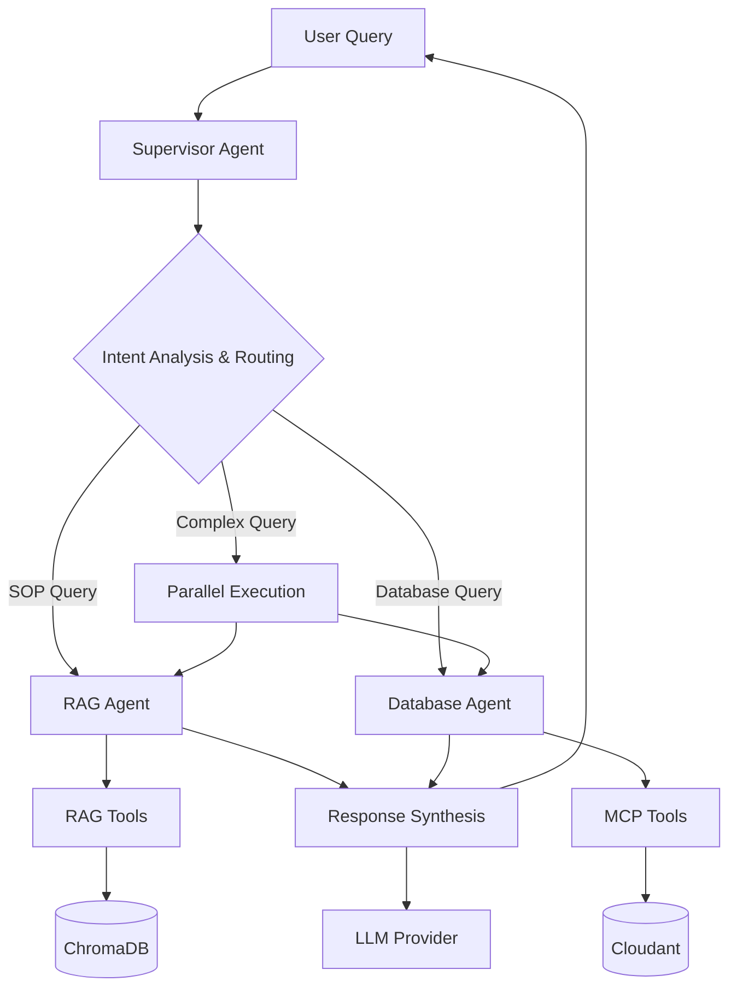
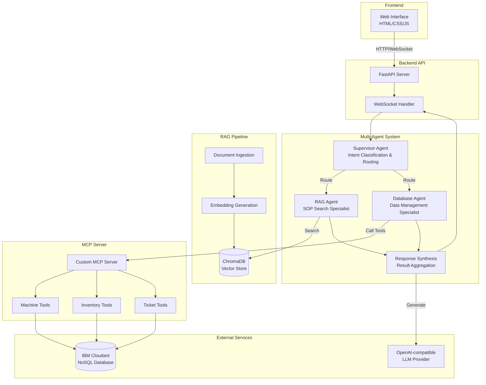

# Field Mind - Multi-Agent System Architecture (Updated)

## System Overview

Field Mind is a multi-agent system designed to assist technicians and field workers with:
- Finding SOPs (Standard Operating Procedures) for problems
- Querying tool/part inventory
- Getting machine information
- Creating purchase tickets for tools/parts

## Technology Stack

### Backend
- **FastAPI**: REST API server
- **LangGraph**: Multi-agent orchestration and workflow management
- **ChromaDB**: Vector database for RAG pipeline
- **OpenAI-compatible LLM**: Configurable provider with base URL and API key
- **Custom MCP Server**: IBM Cloudant integration

### Frontend
- **HTML/CSS/JavaScript**: Simple, responsive web interface
- **WebSocket/SSE**: Real-time streaming responses

### Data Storage
- **IBM Cloudant**: NoSQL database for machines, tools/parts, tickets
- **ChromaDB**: Vector embeddings for SOP documents

## Multi-Agent Architecture

### Agent Hierarchy



### Agent Roles

#### 1. Supervisor Agent
**Purpose:** Orchestrator and decision maker

**Responsibilities:**
- Analyze user query and classify intent
- Determine which specialized agent(s) to delegate to
- Coordinate between multiple agents
- Manage conversation context
- Trigger response synthesis

**Key Capabilities:**
- Intent classification (SOP search, machine query, inventory check, ticket creation)
- Task decomposition for complex queries
- Agent routing and coordination
- Context management across conversation

#### 2. RAG Agent
**Purpose:** Document search and SOP retrieval specialist

**Responsibilities:**
- Semantic search across SOP documents
- Extract relevant procedures and steps
- Provide citations and source references
- Handle all document-related queries

**Tools:**
- `search_sops(query, filters)` - Semantic similarity search
- `get_sop_by_id(sop_id)` - Retrieve specific SOP
- `list_sops_by_machine(machine_type)` - Filter by machine type
- `get_related_sops(sop_id)` - Find related procedures

**Example Queries:**
- "How do I calibrate the CNC machine?"
- "What's the procedure for hydraulic pump replacement?"
- "Show me maintenance steps for overheating issues"

#### 3. Database Agent
**Purpose:** Data retrieval and management specialist

**Responsibilities:**
- Query machine information from Cloudant
- Check inventory and tool availability
- Create and manage purchase tickets
- Handle all structured data operations

**Tools (via MCP Server):**

**Machine Tools:**
- `get_machine_info(machine_id)` - Get machine details
- `search_machines(criteria)` - Search by location, status, etc.
- `get_machine_history(machine_id)` - Maintenance history
- `get_machine_issues(machine_id)` - Common issues

**Inventory Tools:**
- `check_inventory(tool_name)` - Check availability
- `get_tool_details(tool_id)` - Tool specifications
- `search_parts(machine_id)` - Find compatible parts
- `get_low_stock_items()` - Items below threshold
- `get_tools_for_machine(machine_id)` - Required tools

**Ticket Tools:**
- `create_ticket(ticket_data)` - Create purchase/maintenance ticket
- `get_ticket_status(ticket_id)` - Check ticket status
- `list_tickets(filters)` - List with filters
- `update_ticket(ticket_id, updates)` - Update ticket

**Example Queries:**
- "What's the status of CNC Machine Alpha-001?"
- "Do we have torque wrenches in stock?"
- "Create a purchase ticket for 3 hydraulic pumps"

#### 4. Response Synthesis Node
**Purpose:** Combine results from multiple agents into coherent response

**Responsibilities:**
- Aggregate results from RAG and Database agents
- Generate comprehensive, user-friendly response
- Format information appropriately
- Add citations and references

## System Architecture Diagram



## Communication Flow Examples

### Example 1: Simple SOP Query

```
User: "How do I calibrate the CNC machine?"

1. Supervisor Agent:
   - Analyzes query
   - Intent: sop_search
   - Routes to: RAG Agent only

2. RAG Agent:
   - Searches ChromaDB for "CNC calibration"
   - Retrieves top 5 relevant chunks
   - Returns: Calibration procedure with steps

3. Synthesis Node:
   - Formats SOP steps clearly
   - Adds source citations
   - Generates user-friendly response

4. Response: "Here's the CNC calibration procedure from SOP-123..."
```

### Example 2: Complex Multi-Agent Query

```
User: "Machine Alpha-001 is overheating. What should I do and do we have the tools?"

1. Supervisor Agent:
   - Analyzes query
   - Intent: combined (SOP + machine info + inventory)
   - Routes to: Both RAG and Database agents (parallel)

2. RAG Agent (parallel):
   - Searches: "overheating troubleshooting CNC"
   - Returns: Cooling system maintenance SOP

3. Database Agent (parallel):
   - Calls: get_machine_info("machine_001")
   - Calls: get_tools_for_machine("machine_001")
   - Calls: check_inventory for each required tool
   - Returns: Machine status + tool availability

4. Synthesis Node:
   - Combines SOP steps with machine-specific info
   - Lists available tools and missing items
   - Suggests creating ticket if tools missing
   - Generates comprehensive response

5. Response: "Machine Alpha-001 (CNC XYZ-2000) is showing overheating. 
   Here's what to do:
   1. [SOP steps]
   2. Required tools: [list with availability]
   3. Missing: 2 items - would you like me to create a purchase ticket?"
```

### Example 3: Ticket Creation with Context

```
User: "Create a purchase ticket for 3 torque wrenches"

1. Supervisor Agent:
   - Intent: ticket_creation
   - Routes to: Database Agent

2. Database Agent:
   - Calls: check_inventory("torque wrench")
   - Current stock: 2 units
   - Calls: create_ticket({type: "purchase", items: [...]})
   - Returns: Ticket ID and confirmation

3. Synthesis Node:
   - Confirms ticket creation
   - Shows ticket details
   - Mentions current stock level

4. Response: "Purchase ticket #TKT-456 created for 3 torque wrenches.
   Current stock: 2 units
   Priority: Medium
   Status: Pending approval"
```

## LangGraph Implementation

### State Definition

```python
from typing import TypedDict, Annotated, Sequence, List
from langchain_core.messages import BaseMessage
import operator

class AgentState(TypedDict):
    # Conversation
    messages: Annotated[Sequence[BaseMessage], operator.add]
    
    # Routing
    next_agent: str
    agents_called: List[str]
    
    # Results from specialized agents
    rag_result: dict
    database_result: dict
    
    # Context
    user_intent: str
    requires_multiple_agents: bool
    
    # Final output
    final_response: str
```

### Graph Structure

```python
from langgraph.graph import StateGraph, END

def create_multi_agent_graph():
    workflow = StateGraph(AgentState)
    
    # Add nodes
    workflow.add_node("supervisor", supervisor_node)
    workflow.add_node("rag_agent", rag_agent_node)
    workflow.add_node("database_agent", database_agent_node)
    workflow.add_node("synthesize", synthesize_response_node)
    
    # Supervisor routing
    workflow.add_conditional_edges(
        "supervisor",
        route_to_agents,
        {
            "rag_agent": "rag_agent",
            "database_agent": "database_agent",
            "both": "rag_agent",
            "synthesize": "synthesize"
        }
    )
    
    # RAG agent can trigger database agent
    workflow.add_conditional_edges(
        "rag_agent",
        check_if_database_needed,
        {
            "database_agent": "database_agent",
            "synthesize": "synthesize"
        }
    )
    
    # Database agent goes to synthesis
    workflow.add_edge("database_agent", "synthesize")
    workflow.add_edge("synthesize", END)
    
    workflow.set_entry_point("supervisor")
    
    return workflow.compile()
```

## Data Model

### Cloudant Databases

#### machines_db
```json
{
  "_id": "machine_001",
  "name": "CNC Machine Alpha",
  "model": "XYZ-2000",
  "location": "Factory Floor A",
  "status": "operational",
  "last_maintenance": "2026-05-01",
  "common_issues": ["overheating", "calibration drift"],
  "required_tools": ["tool_001", "tool_002"]
}
```

#### inventory_db
```json
{
  "_id": "tool_001",
  "name": "Torque Wrench",
  "type": "tool",
  "quantity": 5,
  "min_quantity": 2,
  "location": "Storage Room B",
  "compatible_machines": ["machine_001", "machine_002"],
  "specifications": {
    "range": "10-100 Nm",
    "accuracy": "±2%"
  }
}
```

#### tickets_db
```json
{
  "_id": "ticket_001",
  "type": "purchase",
  "status": "pending",
  "created_at": "2026-05-17T10:00:00Z",
  "created_by": "technician_01",
  "items": [
    {
      "tool_id": "tool_003",
      "quantity": 3,
      "reason": "Low stock alert"
    }
  ],
  "priority": "medium",
  "notes": "Required for upcoming maintenance"
}
```

## Project Structure

```
FieldMind/
├── backend/
│   ├── app/
│   │   ├── main.py              # FastAPI app
│   │   ├── config.py            # Configuration
│   │   ├── models.py            # Pydantic models
│   │   └── api/
│   │       ├── chat.py          # Chat endpoints
│   │       └── sop.py           # SOP management
│   ├── agent/
│   │   ├── supervisor.py        # Supervisor agent
│   │   ├── rag_agent.py         # RAG specialist
│   │   ├── database_agent.py    # Database specialist
│   │   ├── synthesis.py         # Response synthesis
│   │   ├── state.py             # Agent state
│   │   └── graph.py             # LangGraph definition
│   ├── rag/
│   │   ├── ingestion.py         # Document processing
│   │   ├── retriever.py         # RAG retrieval
│   │   └── embeddings.py        # Embedding generation
│   ├── mcp_server/
│   │   ├── server.py            # MCP server
│   │   ├── cloudant_client.py   # Cloudant wrapper
│   │   └── tools/
│   │       ├── machine.py
│   │       ├── inventory.py
│   │       └── ticket.py
│   ├── requirements.txt
│   └── .env.example
├── frontend/
│   ├── index.html
│   ├── css/
│   │   └── styles.css
│   └── js/
│       ├── app.js
│       └── chat.js
├── data/
│   ├── sops/
│   └── chromadb/
├── docs/
├── tests/
├── .gitignore
├── README.md
├── ARCHITECTURE.md
├── MULTI_AGENT_ARCHITECTURE.md
└── IMPLEMENTATION_GUIDE.md
```

## Advantages of Multi-Agent Architecture

### 1. Separation of Concerns
- Each agent has focused responsibility
- Easier to maintain and debug
- Independent optimization

### 2. Parallel Execution
- RAG and Database agents run simultaneously
- Faster response times
- Better resource utilization

### 3. Scalability
- Add new agents without modifying existing ones
- Scale agents independently
- Easy capability extension

### 4. Specialized Optimization
- RAG Agent optimized for semantic search
- Database Agent optimized for structured queries
- Each uses appropriate techniques

### 5. Better Error Handling
- Isolated failures
- Graceful degradation
- Individual agent retry logic

### 6. Maintainability
- Clear agent boundaries
- Independent testing
- Modular architecture

## Configuration

### Environment Variables
```env
# LLM Configuration
OPENAI_API_BASE_URL=https://api.openai.com/v1
OPENAI_API_KEY=your_api_key
OPENAI_MODEL=gpt-4-turbo

# IBM Cloudant
CLOUDANT_URL=https://your-account.cloudant.com
CLOUDANT_API_KEY=your_cloudant_key
CLOUDANT_USERNAME=your_username
CLOUDANT_PASSWORD=your_password

# ChromaDB
CHROMA_PERSIST_DIRECTORY=./data/chromadb

# FastAPI
API_HOST=0.0.0.0
API_PORT=8000
DEBUG=false

# MCP Server
MCP_SERVER_PORT=3000
```

## Performance Targets

- Simple queries: < 2 seconds
- RAG queries: < 5 seconds
- Complex multi-agent queries: < 10 seconds
- Document ingestion: < 30 seconds per document
- Support 50+ concurrent users
- 99.9% uptime target

## Security Considerations

- API keys in environment variables
- No authentication (internal tool)
- Input validation on all endpoints
- Rate limiting on API calls
- Secure Cloudant connections (HTTPS)
- Audit logging for data access

## Future Enhancements

- Multi-language support
- Voice input/output
- Mobile app (PWA)
- Offline mode
- Predictive maintenance
- Advanced analytics dashboard
- Integration with ERP systems